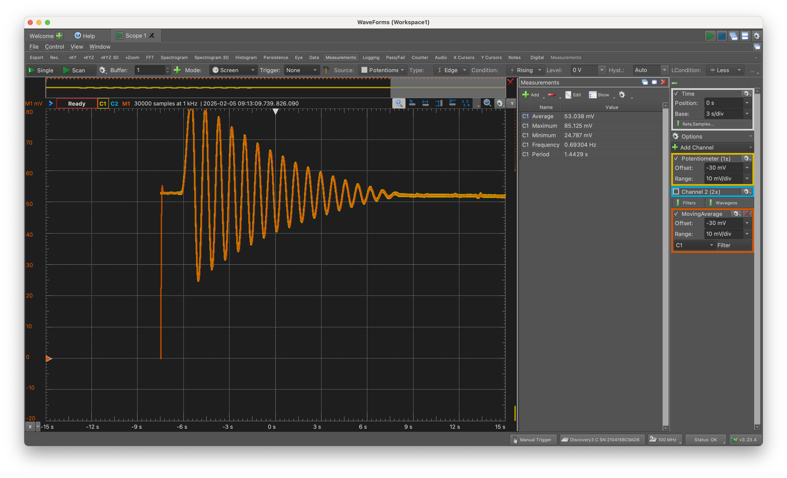
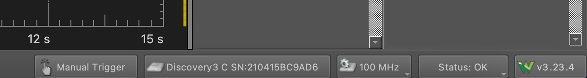
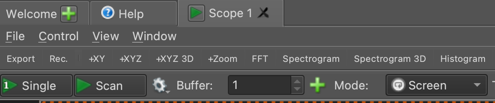
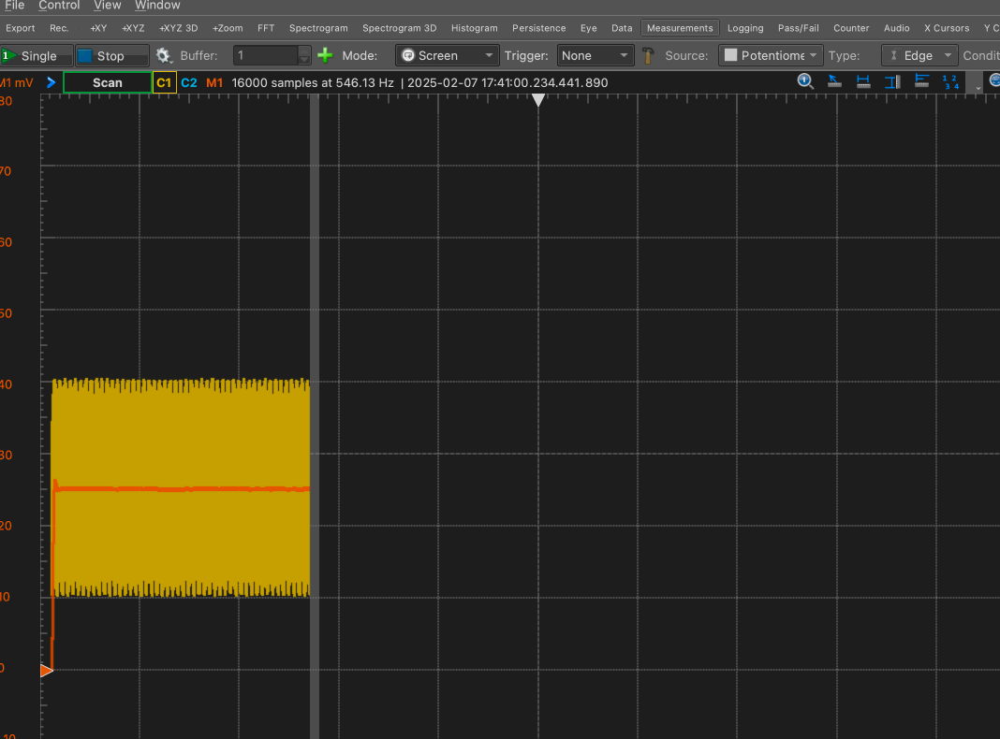
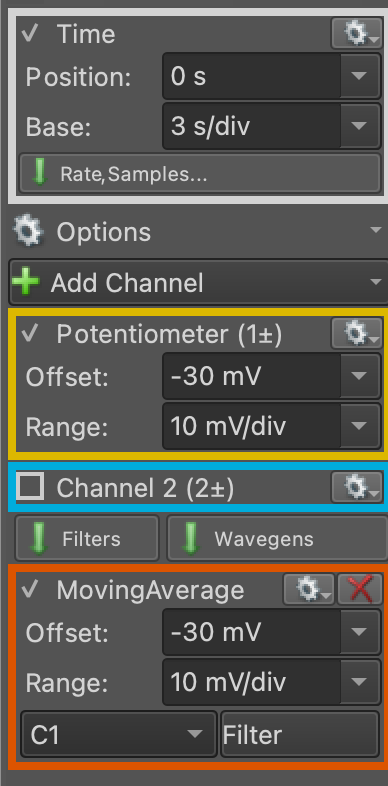
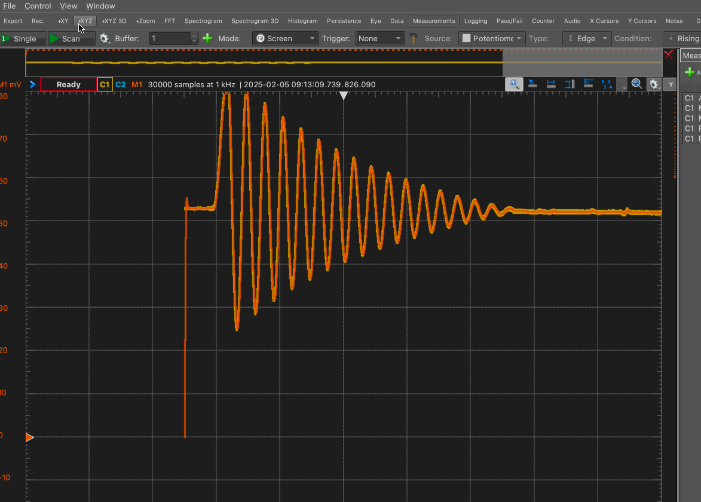

# Lab 1: Linearity, Nonlinearity, and the Compound Pendulum

## Introduction
In this lab, you will ...

## Equipment and hardware

This lab makes use of a compound pendulum mounted onto a potentiometer. The compound pendulum is made of Aluminum, and measures 10" x 1" x 1/4". It is secured with the help of a set-screw to the shaft of the poteniometer. The potentiometer is the [Vishay Spectrol 157-11103](https://www.vishay.com/docs/57042/157.pdf), which provides a voltage reading that is expected to scale, hopefully linearly, with the angle of rotation of the shaft. The potentiometer is wired with alligator clips: red for power, black for ground, and white for the voltage reading.

Data collection is carried out using the [Analog Discovery 3](https://digilent.com/shop/analog-discovery-3/), a multi-purpose data acquisition and signal-generating device. In this lab, the Analog Discovery powers the potentiometer by providing 5V across pins 1 and 3, and reads the voltage from pin 2.

## Software
This lab will make use of the open-source software [WaveForms](https://tinyurl.com/E91LabSoftware) from Digilent, the manufacturer of the analog I/O device that you'll use to collect data.  Download WaveForms, install it on your computer, and bring it with you to the lab.

WaveForms can load a 'workspace', which is a collection of settings that you can pre-load when you run WaveForms. Download the workspace needed for this lab [here]({{ page.permalink }}/../Lab1Workspace.dwf3work). It will look something like this:

{:style="max-width: 100%; height: auto;"}

We will be using Waveforms together with the Analog Discovery 3 as an _Oscilloscope_, which should be a familiar tool for you. If you need to restart from scratch without using the workspace file provided to you, you can re-create the settings by choosing 'Scope' as the tool on the startup screen.

A reference manual for WaveForms is available [here](https://digilent.com/reference/software/waveforms/waveforms-3/reference-manual).

## Wiring and Connections

The wiring should already be set up for you; all you need to do is plug in the USB-c cable from the Analog Discovery. In case you need to re-wire the potentiometer to the Analog Discovery:

- Connect the red wire to V+
- Connect the black wire to any GND
- Connect the white wire to 1+

## Testing the virtual oscilloscope

After connecting your Analog Discovery to your computer and opening WaveForms, the software should recognize the Discovery 3 with a panel on the bottom right as shown here.

{:style="max-width: 100%; height: auto;"}

Start scanning the voltage reading by clicking 'scan' near the top left, which will start a real-time scan of the voltage reading from the potentiometer. Make sure that 'mode' is set to 'Screen' as shown here. 

You should see a trace of the voltage develop across the screen. 'C2' reads the voltage directly, whereas 'M1' is a moving average that acts as a low-pass filter, smoothing out the noise in the voltage. ){:style="max-width: 100%; height: auto;"}

The scale and offset of the horizontal and vertical axes can be controlled using the panels on the right, as shown below. In my experience, a good value for time is 3 s/div and for the voltage is 10 mV/div, but you should feel free to change these settings to suit your needs. These settings do not affect the data collected; they only determine how the data are visualized.

{:style="max-width: 100%; height: auto;"}

## Calibration

Before any dynamic data can be collected, you must calibrate the potentiometer. It is important that you perform the calibration as close as possible to when you collect dynamic data  to minimize the possibility that environmental uncertainties introduce errors into the calibration. Such errors _can_ be fixed during post-processing, but it is best to minimze them when collecting data.

### Drift

It has been noticed that the rest reading of the potentiometer can sometimes drift. Therefore, after switching on the scope, you should wait for the rest reading to settle at a constant value. A good way to decide whether the potentiometer has 'settled' is to check if the reading is off by more than 1 mV in about a minute. Your mileage may vary; just keep in mind that this drift is bad for our experiment.

### Calibrating at zero degrees

We will measure the angle from the vertical, and so the rest reading --- when you are not doing anything to the pendulum --- is zero degrees. After you are satisfied that the drift has settled down, make a 5-second recording at 1 kHz to record the rest reading. This is almost certainly overkill, but computers make it easy for us to save five thousand nearly-equal numbers just so we can average them later.

Select 'Mode: Record' as shown here, and set the sampling rate to 1 kHz with 5 s of total time.



From now on, the 'record' button will use these settings unless you change them. Use this setting to save 

## The Initial Value Problem
Numerically solve the initial value problem given by

$$ \dot{y} = \sin y, \, y(0) = \pi/6.$$

## Using Python

You must have the packages `scipy`, `numpy`, and `matplotlib` installed in order to use the import statements shown below. If you don't know how to install these packages, please see the tutorial [here](https://packaging.python.org/en/latest/tutorials/installing-packages/).

```
from scipy.integrate import solve_ivp
import matplotlib.pyplot as plt
from numpy import array,exp,sin,pi,linspace

def f1(t,x):
    return sin(x)

x_init      = array([pi/6]) 
t_vector    = linspace(0,2*pi,100)
solution1   = solve_ivp(f1,                         # r.h.s of diff. eq
                        (t_vector[0],t_vector[-1]), # start & end time
                        x_init,                     # initial condition
                        t_eval=t_vector)            # times to plot

plt.figure(1)
plt.plot(solution1.t,solution1.y[0],'r.-')
plt.grid()
plt.xlabel('t')
plt.ylabel('x(t)')
plt.show()    # uncomment to preview figure
```

{:style="max-width: 100%; height: auto;"}

## Using Mathematica

```
solution = 
 NDSolve[{y'[t] == Sin[y[t]], y[0] == \[Pi]/6}, y[t], {t, 0, 2 \[Pi]}]

Plot[y[t] /. solution, {t, 0, 2 \[Pi]}]
```

{:style="max-width: 100%; height: auto;"}

## Using MATLAB

```
x_init      = pi/6;
t_vector    = linspace(0,2*pi,100);
[t,x]       = ode45(@rhs,t_vector,x_init);

figure(1);
plot(t,x,LineWidth=2,Marker=".",MarkerSize=12,Color='Red');
xlabel('t');
ylabel('x(t)');
grid on;
```

For this to work, you must have the file `rhs.m` in the same directory, and the file should contain:

```
function [dydt] = rhs(t,y)
dydt = sin(y);
end
```

{:style="max-width: 100%; height: auto;"}
