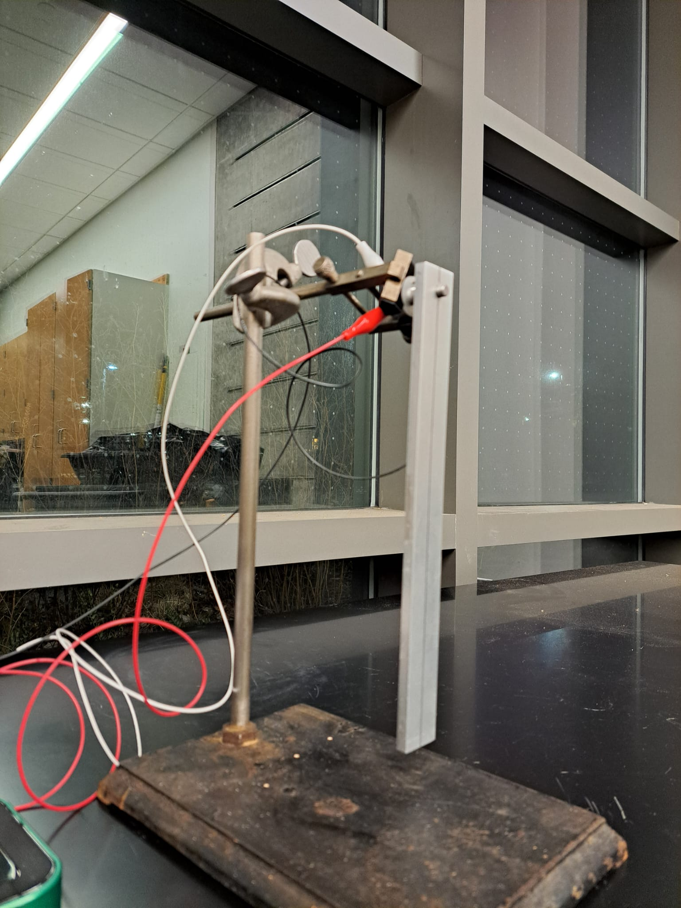

In this lab, you will use a compound pendulum to investigate linear and nonlinear dynamics.

# Logistics

This lab is self-scheduled; you will carry out the tasks here on your own time. The due date is unspecified, but you are recommended to complete the experimental portion of these tasks by February 14. The apparatus is located in Singer Hall 120 (a.k.a. 'the High Bay'). This space is shared with multiple other engineering labs, so please be mindful of the space and respectful of other people's work.

Sign up for times in the High Bay [here](https://tinyurl.com/E91LabSignup) using the drop-down menu as illustrated below. Please keep in mind that there will be other people using the space, especially 1-4 PM, so you are encouraged to find times outside of the usual lab hours. You should all have OneCard access to the High Bay.

{:style="max-width: 100%; height: auto;"}

Your group has been assigned in Moodle; if you asked to be in a particular group, you have been placed with those students. 

# Experiments

## Equipment and hardware

This lab makes use of a compound pendulum mounted onto a potentiometer. The pendulum is secured with the help of a set-screw to the shaft of the poteniometer. **Note:** Make sure the set screw is tight; you don't want the pendulum to go flying off the shaft.

{:style="max-width: 100%; height: auto;"}

The potentiometer is the [Vishay Spectrol 157-11103](https://www.vishay.com/docs/57042/157.pdf), which provides a voltage reading that is expected to scale, hopefully linearly, with the angle of rotation of the shaft. The potentiometer is wired with alligator clips: red for power, black for ground, and white for the voltage reading. 

Data collection is carried out using the [Analog Discovery 3](https://digilent.com/shop/analog-discovery-3/), a multi-purpose data acquisition and signal-generating device. In this lab, the Analog Discovery powers the potentiometer by providing 5V across pins 1 and 3, and reads the voltage from pin 2.

!{:style="max-width: 45%; height: auto;"} {:style="max-width: 45%; height: auto;"}

## Measurements

Measure the length, width, and thickness of the pendulum. You should also measure the distance of the mounting hole from its closest short edge. In addition, use a mass balance (located in the center of the High Bay) to determine its mass. **Note:** You will have to loosen the set screw (using the provided allen key) to make these measurements. Make sure you tighten the set screw securely when you return the pendulum on to the shaft; you don't want the pendulum to go flying off the shaft.

## Software
This lab will make use of the open-source software [WaveForms](https://tinyurl.com/E91LabSoftware) from Digilent, the manufacturer of the analog I/O device that you'll use to collect data.  Download WaveForms, install it on your computer, and bring it with you to the lab.

WaveForms can load a 'workspace', which is a collection of settings that you can pre-load when you run WaveForms. Download the workspace needed for this lab [here]({{ page.permalink }}/../Lab1Workspace.dwf3work). It will look something like this:

{:style="max-width: 100%; height: auto;"}

We will be using Waveforms together with the Analog Discovery 3 as an _Oscilloscope_, which should be a familiar tool for you. If you need to restart from scratch without using the workspace file provided to you, you can re-create the settings by choosing 'Scope' as the tool on the startup screen.

A reference manual for WaveForms is available [here](https://digilent.com/reference/software/waveforms/waveforms-3/reference-manual).

## Wiring and Connections

The wiring should already be set up for you; all you need to do is plug in the USB-c cable from the Analog Discovery. In case you need to re-wire the potentiometer to the Analog Discovery:

- Connect the red wire to V+
- Connect the black wire to any GND
- Connect the white wire to 1+

In case you need to re-connect the alligator clips:

- Connect the red clip to 1
- Connect the white clip to 2
- Connect the black clip to 3

## Testing the virtual oscilloscope

After connecting your Analog Discovery to your computer and opening WaveForms, the software should recognize the Discovery 3 with a panel on the bottom right as shown here.

{:style="max-width: 100%; height: auto;"}

Start scanning the voltage reading by clicking 'scan' near the top left, which will start a real-time scan of the voltage reading from the potentiometer. Make sure that 'mode' is set to 'Screen' as shown here. {:style="max-width: 100%; height: auto;"}

You should see a trace of the voltage develop across the screen. 'C2' reads the voltage directly, whereas 'M1' is a moving average that acts as a low-pass filter, smoothing out the noise in the voltage. {:style="max-width: 100%; height: auto;"}

The scale and offset of the horizontal and vertical axes can be controlled using the panels on the right, as shown below. In my experience, a good value for time is 3 s/div and for the voltage is 10 mV/div, but you should feel free to change these settings to suit your needs. These settings do not affect the data collected; they only determine how the data are visualized.

{:style="max-width: 20%; height: auto;"}

## Calibration

Before any dynamic data can be collected, you must calibrate the potentiometer. It is important that you perform the calibration as close as possible to when you collect dynamic data  to minimize the possibility that environmental uncertainties introduce errors into the calibration. Such errors _can_ be fixed during post-processing, but it is best to minimze them when collecting data.

### Drift

It has been noticed that the rest reading of the potentiometer can sometimes drift. Therefore, after switching on the scope, you should wait for the rest reading to settle at a constant value. A good way to decide whether the potentiometer has 'settled' is to check if the reading is off by more than 1 mV in about a minute. Your mileage may vary; just keep in mind that this drift is bad for our experiment.

### Calibrating at zero degrees

We will measure the angle from the vertical, and so the rest reading --- when you are not doing anything to the pendulum --- is zero degrees. After you are satisfied that the drift has settled down, make a 5-second recording at 1 kHz to record the rest reading. This is almost certainly overkill, but computers make it easy for us to save five thousand nearly-equal numbers just so we can average them later.

Select 'Mode: Record' as shown here, and set the sampling rate to 1 kHz with 5 s of total time.

{:style="max-width: 100%; height: auto;"}

From now on, the 'record' button will use these settings unless you change them.

Use the 'Export' button in the top-left corner to save the result as a CSV file named, e.g., `Deg0.csv`.

### Calibrating at other angles

Use the protractor to make 5-second long recordings of the voltage when the pendulum is held to other angles. One lab partner should hold the pendulum up to the right angle while the other records the reading. 

It is up to you to choose how many angles you would like to do this for; the gold standard is to do this at 10 degree intervals between $\theta = 0^{\circ}$ and $\theta = 170^{\circ}$; avoid trying to do this for $\theta = 180^{\circ}$. It is sufficient to do so for positive values of $\theta$, and to assume that the relationship between voltage and angular position is symmetric about $\theta = 0^{\circ}$.

It is recommended that you save each measurement with a name such as `Deg20.csv`, etc.

## Dynamic Experiments 

You will conduct a series of experiments in which the pendulum is held up to a certain angle and released from rest. Since you have already calibrated the voltage-angle relationship, you need not measure the angle at which you release the pendulum. For each experiment,

- Choose the number of seconds based on how long you think something interesting will happen. Enter this number in the 'Config' box on the top-left corner of WaveForms.
- Use a consistent frame rate when recording data. I recommend using 1 kHz, but you are welcome to use a different value as long as you keep it consistent.
- You may wish to test out the dynamics by using the 'Screen' instead of the 'Record' mode.
- Ensure that the precise moment of release from rest is captured on the oscilloscope. This means that you should click 'Record' _before_ you release the pendulum.

{:style="max-width: 100%; height: auto;"}

Collect dynamic data for the following six cases:

| Case   | Description        | Approximate Angle                      |
|--------|--------------------|----------------------------------------|
| Case 1 | Low acute angle    | Below $30^{\circ}$                     |
| Case 2 | Medium acute angle | Between $60^{\circ}$ and $90^{\circ}$  |
| Case 3 | High acute angle   | A little below $90^{\circ}$            |
| Case 4 | Obtuse angle       | Between $90^{\circ}$ and $120^{\circ}$ |
| Case 5 | High obtuse angle  | Around $150^{\circ}$                   |
| Case 6 | Nearly vertical    | Just less than $180^{\circ}$           |

Save each case as a `*.csv` file.

## Checklist for experiments

- [ ] Task 1
- [ ] Task 2
- [ ]  Task 2.5

# Theory

The equation of motion for a frictionless compound pendulum can be expressed as $$\frac{d}{dt} \left( \boldsymbol{h} \right) = \boldsymbol{M}O$$, where $\boldsymbol{h}$ is the angular momentum of the pendulum about its pivot and $\boldsymbol{M}$ is the moment, $\boldsymbol{r} \times \boldsymbol{F}$ relative to the pivot. After some vector calculus, it is possible to show that the equation becomes $$\ddot{\theta} + \frac{m g l}{I_O} \sin \theta = 0,$$ where

- $m$ is the mass of the object
- $g$ is the acceleration due to gravity
- $l$ is the distance from the pivot to the center of mass
- $I_O$ is the moment of inertia about the pivot.

Recall that the moment of inertia about the centroid of a rectangle with width $w$ and height $w$ in the out-of-plane direction is $I_{G,z} = \frac{m}{12} \left( w^2 + h^2\right)$, where `$G$' stands for 'center of gravity / centroid'. Using the parallel axis theorem, it is possible to write the moment of inertia about a different point --- here, the pivot --- as $$I_O = I_G + m l^2.$$

Making appropriate simplifications, use this information to calculate a numerical value for the coefficient in the equation of motion above.

## The small-angle approximation
Under the small-angle approximation, $\sin \theta \approx \theta$. With this simplification in mind, write down the equation of motion for this pendulum when friction is neglected.

What is the frequency predicted by this equation? (You might want to solve the differential equation if you don't see it right away). Compare this numerical value against the observed frequency from the first few cycles of oscillation in case 1 of your dynamic experiments. You can either use WaveForms to calculate this, or you can 'eyeball' it from a plot, or use something more sophisticated.

In your answer, make sure you think about the difference between 'angular frequency' and 'frequency'.

# Data Analysis

