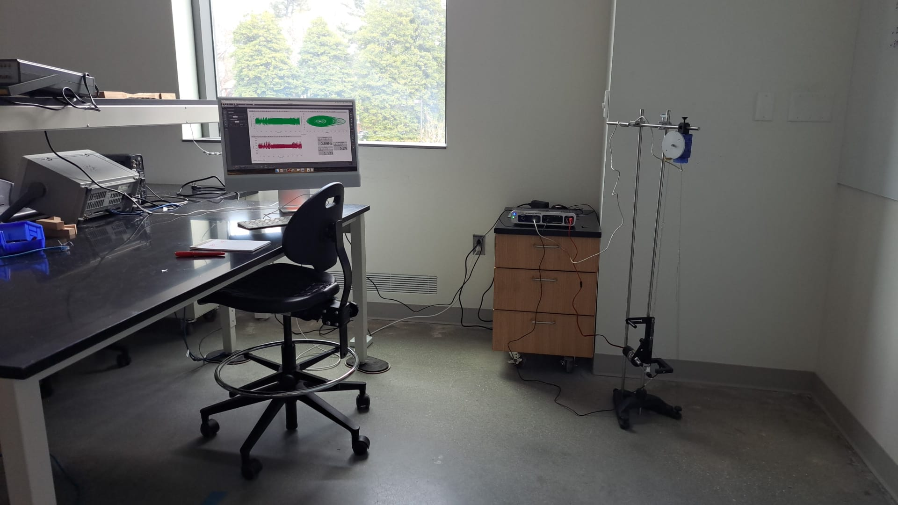

In this lab, you will use an asymmetric rotating disk to explore the non-linear phase plane.

# Logistics

This lab is self-scheduled; you will carry out the tasks here on your own time. The due date for the lab report is March 21. The apparatus is located in Singer Hall 246. This space is shared with multiple other engineering labs, so please be mindful of the space and respectful of other people's work.

Sign up for times [here](https://tinyurl.com/E91LabSignup) using the drop-down menu as illustrated below; an additional sheet has been added for Lab 2. You should all have OneCard access to Singer 246, and if you have any trouble accessing the room, please contact Jennifer Parisien.

{:style="max-width: 100%; height: auto;"}

Your group is the same as for Lab 1.

# Setup

{:style="max-width: 90%; height: auto;"}

## Equipment and hardware

This lab makes use of a rotating disk attached to a pulley that is connected to two springs, one of which is driven by a DC motor whose rotational frequency you can control programmatically. The other spring is simply tied to ground. The rotating disk has a "point mass" attached on its edge, which makes the system asymmetric and therefore much more interesting than a simple pendulum.

{:style="max-width: 45%; height: auto;"} {:style="max-width: 45%; height: auto;"}

In this lab, instead of using raw potentiometer voltages that must be calibrated against 'real-world' angles, you will use a professionally designed rotational motion sensor that can simply tell us the angular displacement $\theta$ and angular velocity $\omega$, with the optional ability to 'zero' the angle reading at the click of a button. The rotational motion sensor is wired with a proprietary serial connection to the PASCO 550 Universal Interface, which reads the analog signal and interprets it in units of your choice. (No callibration yay! unfortunately, you will still have to perform callibration in a later E91 lab)

There is also a magnetic damper located behind the disk.

{:style="max-width: 45%; height: auto;"} 

The DC motor is connected to ground and power (black and red) on the 550 Universal Interface, which is technically a 'signal generator'. This means that the hardware is capable of emitting electrical signals that are a function of time, but we will be using the simplest signal of all: Direct Current. You will be able to control how many volts to provide to the motor. It is rated for 12 V, but you will typically use values much lower than 12V. The motor shaft is connected, via a set screw, to an assembly that allows us to set the amplitude of the circular motion by increasing the length of the arm. 

{:style="max-width: 90%; height: auto;"}

You will also see a plastic 'U'-shaped device attached to the motor mount. This is a 'photogate', which sends a digital signal to the 550 Universal Interface. This signal is 'on' if the infrared ray across the two arms of the photogate is blocked (you should see a red LED light up if you place your hand between the photogate arms) and 'off' if the ray is not blocked.

{:style="max-width: 60%; height: auto;"}

The 550 Universal Interface is a proprietary input/output that serves the same function as the Analog Discovery did in Lab 1. It powers the DC motor with a confiurable DC signal, reads the analog signal from the rotational motion sensor and the digital signal from the photogate, and provides this information to your computer in a user-friendly way using a USB connection. Unlike the Analog Discovery, it **must** be powered separately.

{:style="max-width: 80%; height: auto;"}

## Measurements

In this lab, you do not need to directly measure the mass and dimensions of the rotating disk.

## Software
This lab will make use of [PASCO Capstone](https://www.pasco.com/products/software/capstone#downloads-panel), a proprietary software a license for which has been purchased by ENGR. If you would like to, you can download a copy of PASCO on your own computer; a license costs $1 per student per academic year, and you may be able to circumvent the need for a license by making use of a limited-time free trial. **Note**: No purchase is required for this lab. If you use the lab computer, you don't need your own copy of PASCO Capstone.

PASCO Capstone can make use of a configuration file with extension `*.cap`. Download the workspace needed for this lab [here](Lab2/E91Lab2.cap). It will look approximately like this:

{:style="max-width: 100%; height: auto;"}

Capstone is fully configurable, so you are welcome to modify the settings and move things around if you so wish. If you find that a previous lab group has modified the settings from what you would expect, try reloading the `*.cap` file downloaded from here.

A video tutorial for Capstone is available [here](https://www.pasco.com/resources/video/8HQX7I89b5U).

## Wiring and Connections

This lab is **less** DIY than Lab 1. As such, you should not need to modify the wiring during the normal course of operation of this lab. However, if it turns out that you do need to reconnect the wires, here is a short summary.

- Connect the red and black wires that emerge from the motor into the red and black ports near the 'signal generator' part of the 550 Universal Interface.
- Use the ethernet -- Tip-Sleeve cable to connect the Photogate to the 550. The ethernet cable goes in to the photogate and the T-S cable goes into one of the digital ports of the 550.
- Connect the silver wire that emerges from the rotational motion sensor into one of the 'PASPort' ports of the 550 Universal Interface.

# Free Oscillation

Your first task is to collect some data on the rotating disk oscillating on its own. To do this, you must first zero the sensor by clicking the 'Zero Sensor Now' button while your lab partner holds the golden-colored 'point mass' to an upright position.

{:style="max-width: 80%; height: auto;"}

You must also disable a setting -- which is usually quite useful -- that automatically zeros the rotary motion sensor at the start of every run. Do this like so:

{:style="max-width: 80%; height: auto;"}

After you have done this, the sensor will always recognize the position you zero'd as its zero position until you change this setting. Thus, you can now be confident that, from run to run, the angles are consistent.

Using the 'record' panel on the bottom right, collect a few runs of data in which you start the disk in different positions, and observe its motion. Capstone has already been configured to show you a 'potential well', where potentially energy is calculated by assuming that the initial kinetic energy is zero. You may or may not get a potential well exactly like the one I got, but it should have the general shape of a potential well.

{:style="max-width: 80%; height: auto;"}

### Managing and exporting runs

You can manage your runs by clicking the 'Data Summary' tab on the left toolbar. Here, you can rename your experimental runs in a way that helps you keep track of them. You can go to File > Export Data ... to output a table as CSV. Feel free to 'prune' the exported file to only include data that you are interested in.

{:style="max-width: 80%; height: auto;"}

# Driven Oscillations

## First driven oscillation: 3.3V, no damping

On the 'Driven' tab in Capstone, select 'Signal Generator' and set the output voltage to 3.3 V. Start, recording, then switch the signal generator on. Let the motor run for about 30 seconds, then switch the signal generator off but keep recording until oscillations have died out. Make sure the magnetic damper is positioned as far away from the disk as possible.

{:style="max-width: 80%; height: auto;"}

## 3.9V, no damping

Repeat the experiment from above with a higher voltage. This time, hold the 'point mass' at its topmost position and let go just when your lab partner clicks 'On' on the signal generator. Record for about 45 seconds, switch off the signal generator, then continue to record data until the oscillations have about settled down.

{:style="max-width: 80%; height: auto;"}

## 5.9V ish, no damping 

Repeat the 3.3 V experiment. This time, start the oscillation at 5.9V and wait for some periodic motion to appear. Then, while continuing to record, change the voltage using the signal generator tab. You can move the voltage up to about 6.5V and down to as low as 3.3V, and you can choose whatever pattern you wish. Then -- still recording -- bring the voltage back to 5.9V and wait for a periodic motion to appear.

This recording can be anywhere from 2 to 5 minutes long.

## The effect of damping

Choose any single voltage between 3.3V and 5.9V to operate the motor. Feel free to give it a 'push' -- before you start recording -- to make the disk spin more than 360 degrees in a cycle (but be **gentle** and make sure that the springs don't touch the pulley!). Begin recording, and then have your lab partner screw the magnetic damper closer to the disk. Your task is to do this until you see a noticeable difference in the dynamics, but it is possible that you won't see much of a difference.

This recording can be anywhere between 1 and 3 minutes long.

## Sweep the driving frequency

Choose five voltage levels between 3.3V and 5.9V. For each of these, begin the motion from rest, i.e., begin recording just before clicking 'on' on the signal generator. Keep the signal generator on for as long as you think something interesting is happening, then switch it off. Record until the oscillations die out.

It is not necessary for each recording to be the same length.

## (Optional) video

You may want to take a video of the disk's motion if it does something particularly interesting. For example:

{:style="max-width: 50%; height: auto;"}

# Report

Prepare a lab report that includes all of your data. 

For the free oscillation experiment, plot $\theta$ and $\omega$ against time, and plot the quantity $U$ (calculated in Capstone) against $\theta$. You may include multiple sets of data if you collected more than one.

For the driven oscillations, plot $\theta$ and $\omega$ against time, and plot $\theta$ against $\omega$ for each dataset on a single page, i.e., the plots for any one experiment should not be split over multiple pages. For each dataset, include plot titles, captions, axis labels, and a short paragraph describing what you observed.

There is no 'theory' section for this lab.

# Troubleshooting

### Trouble recognizing the sensors in Capstone
If the sensors no longer appear in Capstone, you can dsiconnect and reconnect the sensors (electronically) using the 'Hardware Setup' tab on the left toolbar. You can also start a new `*.cap` file from scratch and follow the gif below to see how to connect the sensors. 

{:style="max-width: 80%; height: auto;"}

### The string is improperly wound
If the string seems to be unbalanced, the rest length of the springs seems off compared to the picture above, or you just suspect something is wrong with the pulley -- check to make sure that both ends of the string emerge from the large wheel of the pulley and not the small wheel of the pulley. If this is not the case, you may need to manually pull the string over the large wheel.

### The strings come off the springs
It is possible to simply re-tie the ends of the string to the ends of the springs with a very simple knot. The rest length of the springs should be about as much as you see in the picture of the apparatus above; it is not necessary to get this precisely right.

### The motor shaft seems loose or wobbly
Ensure the set screw is firmly in place, and that it's in contact with the flat side of the D-shaped motor shaft. Use an allen wrench to tighten if need be.

