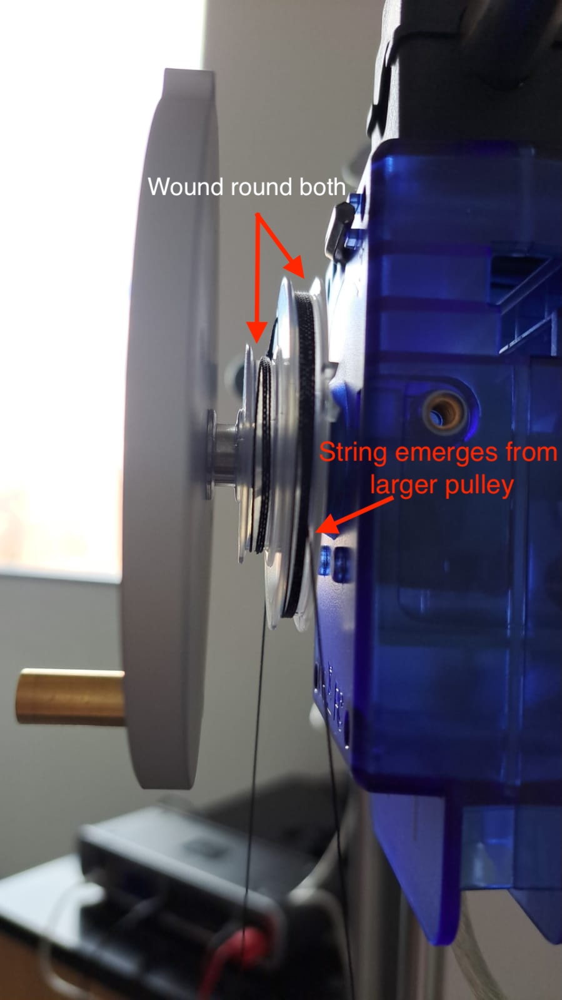
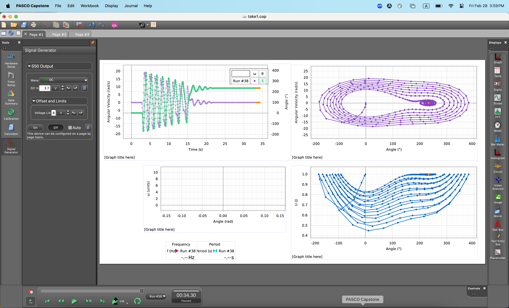

In this lab, you will use an asymmetric rotating disk to explore the non-linear phase plane.

# Logistics

This lab is self-scheduled; you will carry out the tasks here on your own time. The due date for the lab report is TBD and will be after spring break. The apparatus is located in Singer Hall 246. This space is shared with multiple other engineering labs, so please be mindful of the space and respectful of other people's work.

Sign up for times [here](https://tinyurl.com/E91LabSignup) using the drop-down menu as illustrated below; an additional sheet has been added for Lab 2. You should all have OneCard access to Singer 246, and if you have any trouble accessing the room, please contact Jennifer Parisien.

{:style="max-width: 100%; height: auto;"}

Your group is the same as for Lab 1.

# Setup

{:style="max-width: 45%; height: auto;"}

## Equipment and hardware

This lab makes use of a rotating disk attached to a pulley that is connected to two springs, one of which is driven by a DC motor whose rotational frequency you can control programmatically. The other spring is simply tied to ground.

{:style="max-width: 45%; height: auto;"} {:style="max-width: 45%; height: auto;"}

In this lab, instead of using raw potentiometer voltages that must be calibrated against 'real-world' angles, you will use a professionally designed rotational motion sensor that can simply tell us the angular displacement $\theta$ and angular velocity $\omega$, with the optional ability to 'zero' the angle reading at the click of a button. The rotational motion sensor is wired with a proprietary serial connection to the PASCO 550 Universal Interface, which reads the analog signal and interprets it in units of your choice. (No callibration yay! unfortunately, you will still have to perform callibration in a later E91 lab)

There is also a magnetic damper located behind the disk.

{:style="max-width: 45%; height: auto;"} 

The DC motor is connected to ground and power (black and red) on the 550 Universal Interface, which is technically a 'signal generator'. This means that the hardware is capable of emitting electrical signals that are a function of time, but we will be using the simplest signal of all: Direct Current. You will be able to control how many volts to provide to the motor. It is rated for 12 V, but you will typically use values much lower than 12V. The motor shaft is connected, via a set screw, to an assembly that allows us to set the amplitude of the circular motion by increasing the length of the arm. 

{:style="max-width: 90%; height: auto;"}

You will also see a plastic 'U'-shaped device attached to the motor mount. This is a 'photogate', which sends a digital signal to the 550 Universal Interface. This signal is 'on' if the infrared ray across the two arms of the photogate is blocked (you should see a red LED light up if you place your hand between the photogate arms) and 'off' if the ray is not blocked.

{:style="max-width: 60%; height: auto;"}

The 550 Universal Interface is a proprietary input/output that serves the same function as the Analog Discovery did in Lab 1. It powers the DC motor with a confiurable DC signal, reads the analog signal from the rotational motion sensor and the digital signal from the photogate, and provides this information to your computer in a user-friendly way using a USB connection. Unlike the Analog Discovery, it **must** be powered separately.

{:style="max-width: 80%; height: auto;"}

## Measurements

In this lab, you do not need to directly measure the mass and dimensions of the rotating disk.

## Software
This lab will make use of [PASCO Capstone](https://www.pasco.com/products/software/capstone#downloads-panel), a proprietary software a license for which has been purchased by ENGR. If you would like to, you can download a copy of PASCO on your own computer; a license costs $1 per student per academic year, and you may be able to circumvent the need for a license by making use of a limited-time free trial. **Note**: No purchase is required for this lab. If you use the lab computer, you don't need your own copy of PASCO Capstone.

PASCO Capstone can make use of a configuration file with extension `*.cap`. Download the workspace needed for this lab [here](Lab2/E91Lab2.cap). It will look approximately like this:

{:style="max-width: 100%; height: auto;"}

Capstone is fully configurable, so you are welcome to modify the settings and move things around if you so wish. If you find that a previous lab group has modified the settings from what you would expect, try reloading the `*.cap` file downloaded from here.

A video tutorial for Capstone is available [here](https://www.pasco.com/resources/video/8HQX7I89b5U).

## Wiring and Connections

This lab is **less** DIY than Lab 1. As such, you should not need to modify the wiring during the normal course of operation of this lab. However, if it turns out that you do need to reconnect the wires, here is a short summary.

- Connect the red and black wires that emerge from the motor into the red and black ports near the 'signal generator' part of the 550 Universal Interface.
- Use the ethernet -- Tip-Sleeve cable to connect the Photogate to the 550. The ethernet cable goes in to the photogate and the T-S cable goes into one of the digital ports of the 550.
- Connect the silver wire that emerges from the rotational motion sensor into one of the 'PASPort' ports of the 550 Universal Interface.

# Free Oscillation

Your first task is to collect some data on the rotating disk oscillating on its own. To do this, you must first zero the sensor by clicking the 'Zero Sensor Now' button while your lab partner holds the golden-colored 'point mass' to an upright position.

{:style="max-width: 80%; height: auto;"}

You must also disable a setting -- which is usually quite useful -- that automatically zeros the rotary motion sensor at the start of every run. Do this like so:

{:style="max-width: 80%; height: auto;"}

After you have done this, the sensor will always recognize the position you zero'd as its zero position until you change this setting. Thus, you can now be confident that, from run to run, the angles are consistent.

Using the 'record' panel on the bottom right, collect a few runs of data in which you start the disk in different positions, and observe its motion. Capstone has already been configured to show you a 'potential well', where potentially energy is calculated by assuming that the initial kinetic energy is zero. You may or may not get a potential well exactly like the one I got, but it should have the general shape of a potential well.

{:style="max-width: 80%; height: auto;"}

### Managing and exporting runs

You can manage your runs by clicking the 'Data Summary' tab on the left toolbar. Here, you can rename your experimental runs in a way that helps you keep track of them. You can go to File > Export Data ... to output a table as CSV. Feel free to 'prune' the exported file to only include data that you are interested in.

{:style="max-width: 80%; height: auto;"}

# Driven Oscillations

## First driven oscillation: 3.3V, no damping

On the 'Driven' tab in Capstone, select 'Signal Generator' and set the output voltage to 3.3 V. Start, recording, then switch the signal generator on. Let the motor run for about 30 seconds, then switch the signal generator off but keep recording until oscillations have died out. Make sure the magnetic damper is positioned as far away from the disk as possible.

{:style="max-width: 80%; height: auto;"}

## Second driven oscillation: 3.9V, no damping

Repeat the experiment from above with a higher voltage. This time, hold the 'point mass' at its topmost position and let go just when your lab partner clicks 'On' on the signal generator. Record for about 45 seconds, switch off the signal generator, then continue to record data until the oscillations have about settled down.

{:style="max-width: 80%; height: auto;"}

## Third driven oscillation: 5.9 ish V, no damping

Repeat the 3.3 V experiment. This time, record for longer and move the voltage up and down ...

## Damping ...

## Systematic search ...

# Data Analysis

## Experimentally observed frequency

Your dynamic experiments, being affected by friction like all real engineered systems, will have a decaying behaviour in which oscillatory motion eventually dies out until there is no more motion. However, there is often a nearly-constant period with which the pendulum oscillates while it does.

Your first data analysis task is to determine the experimentally observed frequency (in `swings per second', with units of Hz) for each of cases 1 through 6. You may choose any method to do this, as long as you are consistent across the different experiments. Use your best engineering judgement, and be prepared to explain in your lab report your method and your rationale for choosing this method.

Note that:

- we are interested only in the frequency during the first few (say, first five) swings of the pendulum
- we would like a single value for each case, even if you notice the frequency changing with time.

## Comparison with theory

Compare your measurements of the pendulum's frequency with the theoretical value that you found from using the equation of motion for a frictionless pendulum undergoing small oscillations. Present this data visually using any method of your choice.

## Calibration

Using the static data that you collected, make a plot of voltage on the horizontal axis and angle $\theta$ (in degrees) on the vertical axis. Draw a line (or, if necessary, a curve) of best fit, and determine its coefficients. Your final result should look something like the following, although your specific numbers may be different.

{:style="max-width: 80%; height: auto;"}

Use these coefficients to translate data from all six cases into angles instead of voltages. You do not need to turn in this data. 

Without any further data processing, plot the resulting information on six axes neatly arranged in a 2x3 or 3x2 grid. In these plots, the y-axis should be in units of degrees, and the x-axis in units of seconds. **Note**: Do not remove any data from the beginning of your measurement. You may choose to truncate your data toward the end if the pendulum isn't doing anything interesting.

## Data fitting and the damping parameter

It will be clear that the experiments involve such a large degree of damping that using the undamped equations of motion of the pendulum is not very useful beyong a rudimentary estimate of the frequency of its motion. In the next step, you will use the linearized equations of motion with damping to fit the experimental data. To do this, you must have the correct solution to the 'incorporating damping effects' part of the Theory section. This solution is in the form of a function $\theta(t)$ that has several parameters; although some of these parameters can be determined theoretically, in this section we will determine all parameters by a best-fit procedure that is described below. 

### Fitting the pendulum's nonlinear (?) dynamics to the linear model with damping.

When performing a fit to the data, it is necessary to incorporate some additional parameters that are entirely 'experimental', in the sense that they help us reconcile the observed data with the mathematical model that arises from the laws of physics. One such simple model could be of the form

$$\theta(t) = A e^{Bt} \cos (Ct -D),$$ 

where $B$ and $C$ have some physical meaning, as you found earlier in the theory section; $A$ serves to scale the linear solutions based on the initial condition (recall that, in the linear world, 2x a solution is also a solution), and $D$ serves to move the data around on the horizontal axis so that it starts at the 'top' of the cosine curve.

Your task is to:

- attempt to fit all the data you collected to $\theta(t)$ of the above form, by obtaining parameters $\{A,B,C,D\}$ for each of the dynamic experiments that you conducted.
- Make plots of all your experimental data overlaid with the best-fit model that you can manage. It is unclear how well the model will work for large $\theta_0$. 
- Make a visual summary of how the parameters change with $\theta_0$; this can be in the form of one or more scatter plots, bar charts, or line plots.
- Rate how well each of your dynamic experiments is captured by the linear model overall.

# Narrative

Write a lab report based on the pieces of information you have collected and/or generated during these experiments. Make it as self-contained as possible, so that the reader can fully understand the experiments you conducted, the data analysis that you conducted, and the theory that ties them together. Comment on the ability of the linear model of pendulum dynamics to predict the behavior of a real pendulum.

Turn in a single PDF with figures embedded in the narrative. Attach any code you write in an appendix.

# Troubleshooting

## Trouble recognizing the sensors in Capstone
If the sensors no longer appear in Capstone, you can dsiconnect and reconnect the sensors (electronically) using the 'Hardware Setup' tab on the left toolbar. You can also start a new `*.cap` file from scratch and follow the gif below to see how to connect the sensors. 

{:style="max-width: 15%; height: auto;"} {:style="max-width: 80%; height: auto;"}

Hello, world
