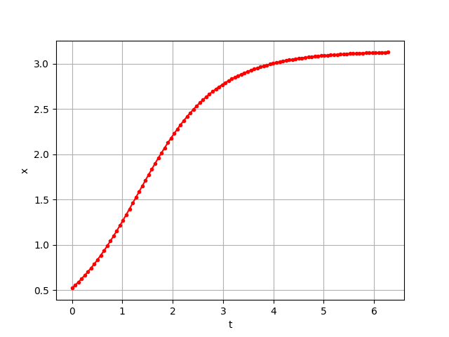
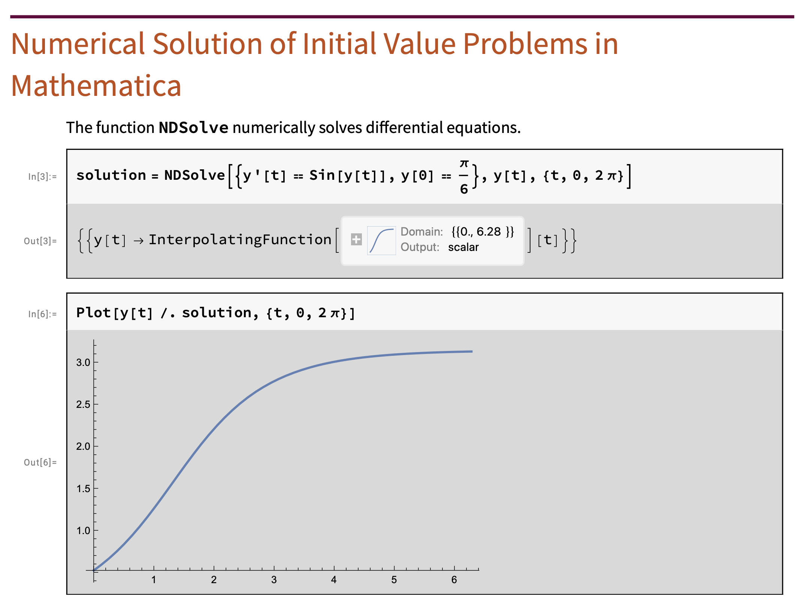
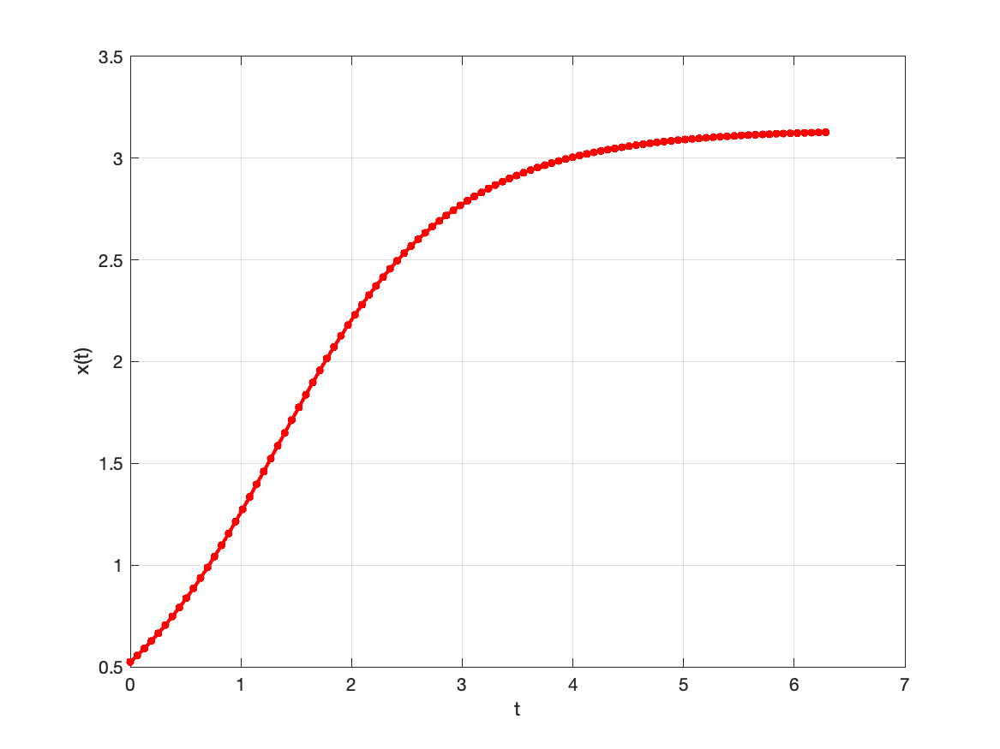

## The Initial Value Problem
Numerically solve the initial value problem given by

$$ \dot{y} = \sin y, \, y(0) = \pi/6.$$

## Using Python

You must have the packages `scipy`, `numpy`, and `matplotlib` installed in order to use the import statements shown below. If you don't know how to install these packages, please see the tutorial [here](https://packaging.python.org/en/latest/tutorials/installing-packages/).

```
from scipy.integrate import solve_ivp
import matplotlib.pyplot as plt
from numpy import array,exp,sin,pi,linspace

def f1(t,x):
    return sin(x)

x_init      = array([pi/6]) 
t_vector    = linspace(0,2*pi,100)
solution1   = solve_ivp(f1,                         # r.h.s of diff. eq
                        (t_vector[0],t_vector[-1]), # start & end time
                        x_init,                     # initial condition
                        t_eval=t_vector)            # times to plot

plt.figure(1)
plt.plot(solution1.t,solution1.y[0],'r.-')
plt.grid()
plt.xlabel('t')
plt.ylabel('x(t)')
plt.show()    # uncomment to preview figure
```

{:style="max-width: 100%; height: auto;"}

## Using Mathematica

```
solution = 
 NDSolve[{y'[t] == Sin[y[t]], y[0] == \[Pi]/6}, y[t], {t, 0, 2 \[Pi]}]

Plot[y[t] /. solution, {t, 0, 2 \[Pi]}]
```

{:style="max-width: 100%; height: auto;"}

## Using MATLAB

```
x_init      = pi/6;
t_vector    = linspace(0,2*pi,100);
[t,x]       = ode45(@rhs,t_vector,x_init);

figure(1);
plot(t,x,LineWidth=2,Marker=".",MarkerSize=12,Color='Red');
xlabel('t');
ylabel('x(t)');
grid on;
```

{:style="max-width: 100%; height: auto;"}
